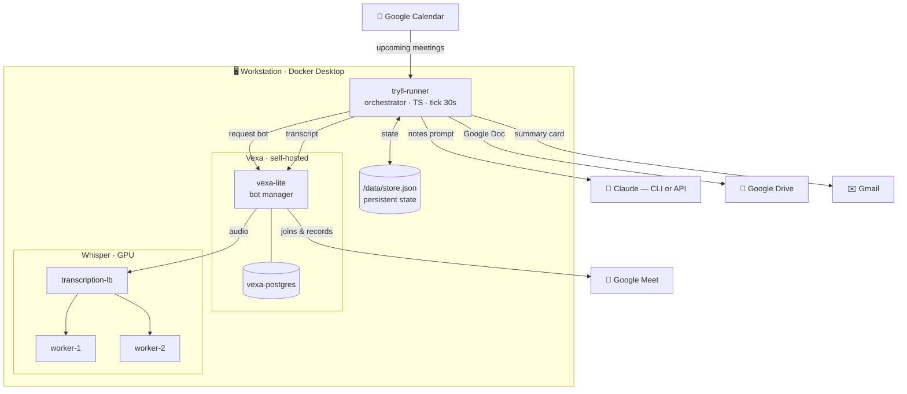
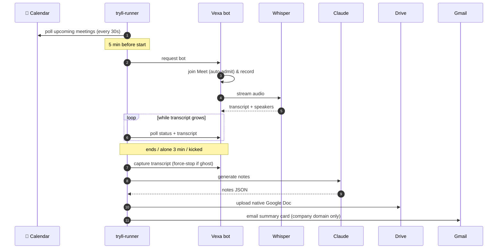
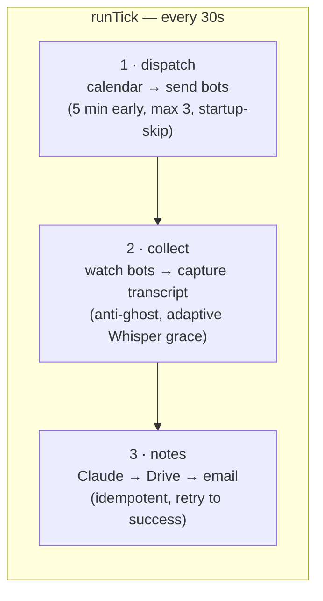
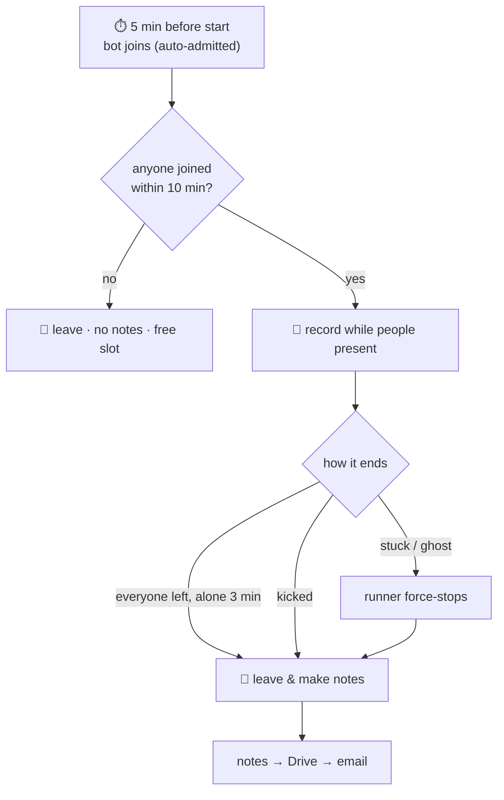
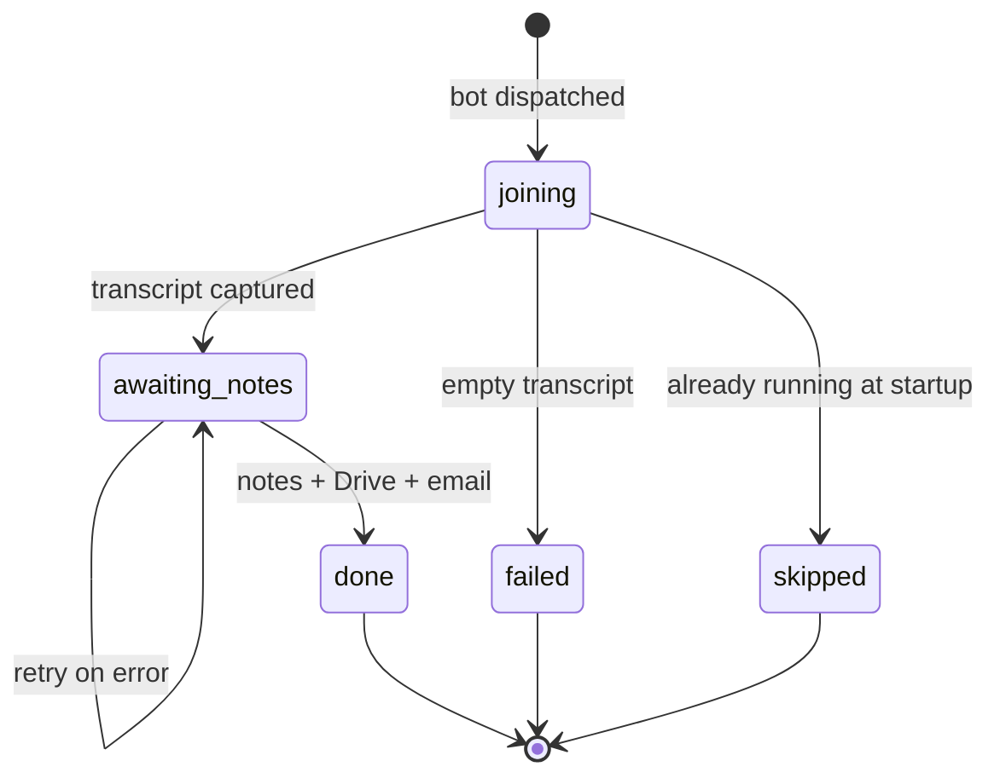

# Tryll Meet Notes

> Calendar-driven meeting-notes automation: watches Google Calendar, sends a bot
> into each Google Meet call, transcribes **with speaker names**, generates
> structured notes with **Claude**, saves them as a native **Google Doc** on
> Google Drive, and emails a branded summary card to the company's participants.

Everything runs **locally in Docker** on a workstation — no dedicated 24/7 server
needed. Start Docker and the stack comes alive and handles meetings on its own.

## Contents

- [Architecture](#architecture)
- [End-to-end flow](#end-to-end-flow)
- [The orchestrator tick](#the-orchestrator-tick)
- [Bot lifecycle](#bot-lifecycle)
- [Meeting state machine](#meeting-state-machine)
- [Notes & email](#notes--email)
- [State & persistence](#state--persistence)
- [Components & code map](#components--code-map)
- [Configuration](#configuration)
- [Run](#run)

## Architecture



The **runner** is the brain (this repo). **Vexa** is the body (the bot that
actually sits in the call). **Whisper** turns audio into a speaker-labelled
transcript. **Claude** writes the notes. Google Drive/Gmail are the output.

## End-to-end flow



## The orchestrator tick

`src/core.ts` runs one tick every 30 seconds in three steps:



| Step | What it does |
|------|--------------|
| **1 · dispatch** | Reads upcoming meetings, sends a Vexa bot **5 min before** start. Max `MAX_CONCURRENT_BOTS` (default 3); extras wait for a free slot. **Startup-skip:** if the runner just woke and a meeting is already running > `STARTUP_SKIP_MIN`, it's skipped. |
| **2 · collect** | While the transcript **grows**, the meeting is live (longer-than-scheduled is fine). On stall / end / kick it captures the transcript. If a bot is stuck or falsely reported as running, the runner **force-stops** it — a slot is always freed (no ghosts). Adaptive grace lets Whisper finish the tail (up to 5 min, sooner if done). |
| **3 · notes** | Generates notes with Claude, uploads a native Google Doc, emails the card. **Idempotent & retried until success** — exactly one doc and one email per meeting, surviving restarts. |

## Bot lifecycle



- **Joins 5 min before** the scheduled start; under a company Google account it is
  **auto-admitted** (no waiting room).
- **Nobody within 10 min** → leaves, no notes, frees the slot.
- **Everyone leaves**, bot alone **3 min** → leaves and makes notes.
- **Kicked** → leaves immediately, frees the slot, notes from what was captured,
  does not rejoin.
- **Startup-skip** — no 24/7 server, so if the runner wakes (Docker just started)
  and a meeting is **already running > 5 min**, the bot won't join near the end.

## Meeting state machine



Each meeting has exactly one record, keyed by calendar event id, so a bot never
re-joins a meeting it already handled.

## Notes & email

- Notes **body** is written in the **meeting's language**; the file name and the
  email TL;DR are always in **English**.
- Sections: TL;DR · decisions · action items (`owner → task → due`) · open
  questions · discussion summary · full transcript.
- Saved to Drive as a native Google Doc, organised by series:

```
Drive root/
├── Sync Tryll/
│   └── Sync Tryll - 2026-06-22
└── One-off meetings/
    └── Partner call - 2026-06-08
```

- The email is a branded HTML card (logo, "Open meeting notes" button, English
  TL;DR, signature). Sent **only to attendees on the company domain** — external
  guests are never emailed.

## State & persistence

Processed meetings are tracked in a small store written **atomically** to
`/data/store.json` on a Docker volume — it survives restarts, so the runner
remembers what it already handled. If Upstash Redis env vars are set, Redis is
used instead.

## Components & code map

| Container | Role |
|-----------|------|
| `tryll-runner` | Orchestrator (this repo) |
| `vexa-lite` + `vexa-postgres` | [Vexa](https://github.com/Vexa-ai/vexa) self-hosted meeting bot |
| `transcription-lb` + workers | Self-hosted Whisper (`large-v3-turbo`, GPU) |

TypeScript, run directly with `tsx` (no build step):

| File | Responsibility |
|------|----------------|
| `src/calendar.ts` | Google Calendar polling, Meet-code dedup, attendees |
| `src/vexa.ts` | Vexa REST client + leave timeouts |
| `src/core.ts` | Orchestrator: dispatch / collect / notes |
| `src/notes.ts`, `src/notes-cli.ts` | Notes via Claude API / Claude CLI |
| `src/docx.ts`, `src/drive.ts` | Document build + Drive upload (Google Doc) |
| `src/email.ts`, `src/finalize.ts` | Summary email + idempotent finalize |
| `src/store.ts` | Persistent state |

Vexa runs with small local patches (`scripts/patch_*`): authenticated join under
a domain profile, an avatar camera, and robust leave detection.

## Configuration

Copy `.env.example` → `.env` and fill it in:

| Variable | Purpose |
|----------|---------|
| `GOOGLE_CLIENT_ID` · `GOOGLE_CLIENT_SECRET` · `GOOGLE_REFRESH_TOKEN` | Google OAuth (Calendar read, Drive, Gmail send) |
| `GOOGLE_CALENDAR_IDS` | Calendars to watch (comma-separated; default `primary`) |
| `VEXA_BASE_URL` · `VEXA_API_KEY` | Vexa endpoint and key |
| `BOT_AUTHENTICATED` · `BOT_AVATAR_URL` | Domain auto-admit + bot avatar |
| `NOTES_MODE` | `cli` (Claude subscription) or `api` (`ANTHROPIC_API_KEY`) |
| `NOTES_EMAIL` · `NOTES_EMAIL_FROM` · `COMPANY_DOMAIN` | Auto-email of notes |
| `DRIVE_ROOT_FOLDER_ID` | Drive folder for the notes tree |
| `MAX_CONCURRENT_BOTS` · `STARTUP_SKIP_MIN` | Concurrency limit / startup-skip threshold |

Opt a meeting out of recording by adding `[norec]` to its calendar title.

## Run

```bash
docker compose up -d --build      # build & start the runner (restarts with Docker)
docker logs -f tryll-runner       # watch activity
```

The runner attaches to the same Docker network as Vexa and ticks automatically.
For a plain local run without a container: `npm install && npm run local`.
